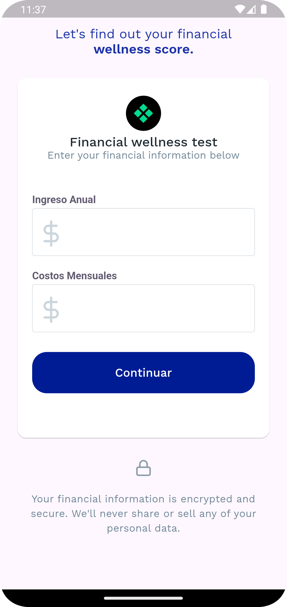
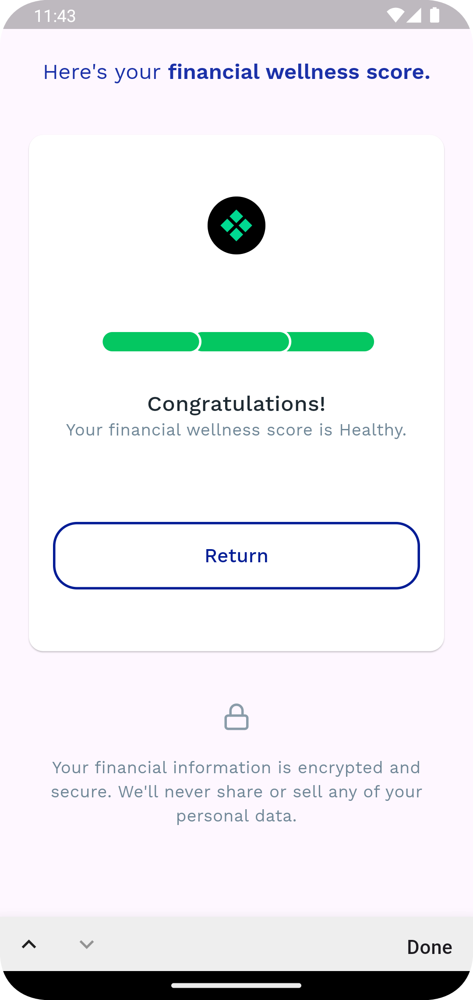
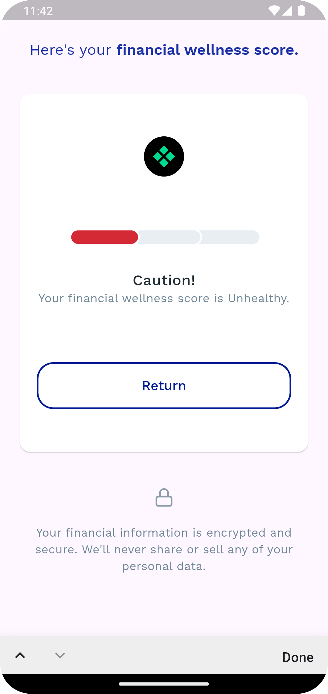

# Financial Wellness App

## Overview

The **Financial Wellness App** is a Flutter-based application designed to help users evaluate their financial health. The app allows users to input their annual income and monthly costs, calculate their financial score, and provide a personalized assessment based on their financial well-being.

## Features

- **Financial Score Calculation:** Users can input their annual income and monthly costs to receive a financial wellness score.
- **Localized in Multiple Languages:** The app is localized in English and Spanish to cater to a diverse user base.
- **BLoC Pattern:** State management is handled using the BLoC pattern to separate business logic from UI code.
- **Custom Input Fields:** The app provides a customized input field for entering financial data, including a money formatter.
- **Responsive Design:** The app is designed to be responsive and works on mobile, tablet, and web platforms.

## Technologies Used

- **Flutter:** The app is built using Flutter, a popular open-source framework for building natively compiled applications for mobile, web, and desktop from a single codebase.
- **BLoC:** State management is handled using the BLoC pattern to separate business logic from UI code.
- **GoRouter:** For handling routing and navigation.
- **GetIt:** Dependency injection to manage app-wide dependencies.
- **intl:** For localization and internationalization support.
- **flutter_svg:** For rendering SVG images.

## Project Structure
The project follows a modular architecture with the following structure:

```
financial_wellness_app/
│
├── assets/                              # Contains images and icons used in the app
│   ├── icons/
│   └── images/
│
├── lib/
│   ├── core/                            # Core functionalities like services, themes, and utilities
│   │   ├── common/                      # Common utilities and resources
│   │   ├── services/                    # Dependency injection and service setup
│   │   ├── theme/                       # Colors, fonts, and overall app theming
│   │   └── utils/                       # Utility classes and functions (like input formatters)
│   │
│   ├── feature/                         # Feature-specific code
│   │   ├── financial_calculator/        # Main feature folder for financial wellness calculations
│   │   │   ├── data/                    # Data repositories and API calls
│   │   │   ├── domain/                  # Business logic and use cases
│   │   │   ├── presentation/            # UI elements like screens, widgets, and state management (BLoC)
│   │   │   └── blocs/                   # BLoC related files for state management
│   │   │
│   │   └── init/                        # Initialization and welcome screen
│   │
│   ├── l10n/                            # Localization files for different languages
│   │   ├── generated/                   # Automatically generated localization files
│   │   └── intl_en.arb, intl_es.arb     # Localization files (English and Spanish)
│   │
│   └── main.dart                        # The entry point of the application
│
└── pubspec.yaml                         # Contains project metadata and dependencies
```

### Folder Structure

The project is organized as follows:

- **lib/**
  - **core/**: Contains utility classes, dependency injection setup, and common resources like images and colors.
  - **feature/**: The feature-specific code for financial calculations and the presentation layer.
  - **l10n/**: Localization files for supporting multiple languages (English and Spanish).
- **assets/**: Contains images and icons used throughout the app.

### Localization

The app supports English and Spanish. The localization files are located in `lib/l10n/`, and translations are automatically generated using the `flutter_intl` package.

### Dependencies

- **flutter_bloc:** A package for managing app state using the BLoC pattern.
- **flutter_svg:** To display SVG images.
- **get_it:** For dependency injection.
- **go_router:** For handling routing and navigation.
- **intl:** For internationalization and date formatting.
- **keyboard_actions:** For managing keyboard actions and focus.

## 📸 Screenshots

| Form Screen | Result Screen | Result Screen |
|-------------|--------------|----------------|
|  |  |  |

## Getting Started

### Prerequisites

- Flutter SDK 3.5.4 or later
- Dart SDK 3.5.4 or later
- Dependencies listed in the `pubspec.yaml`

### Installation

1. Clone the repository:
   ```bash
   git clone https://github.com/yourusername/financial_wellness_app.git
   ```

2. Navigate to the project directory:
   ```bash
   cd financial_wellness_app
   ```

3. Install the dependencies:
   ```bash
   flutter pub get
   ```

4. Run the app:
   ```bash
   flutter run
   ```

## How It Works

1. **User Input:** 
   - Users enter their **Annual Income** and **Monthly Costs**.
   - The app validates the input to ensure it is in the correct format.

2. **Financial Score Calculation:**
   - The app uses the formula defined in the `CalculateFinancialScore` class to calculate the financial score:
     - If monthly costs are less than or equal to 25% of annual income, the score is **Healthy**.
     - If monthly costs are less than or equal to 75%, the score is **Medium**.
     - Otherwise, the score is **Low**.

3. **Displaying Results:**
   - Based on the calculated score, users see a corresponding result page with a progress bar showing their financial health.
   - The result page provides a congratulatory message if the score is "Healthy", a suggestion for improvement if "Medium", and a cautionary message if "Low".

## App Screens

1. **Welcome Screen:**
   - Shows a welcome message and the app logo.

2. **Financial Status Form:**
   - Users input their financial data here.

3. **Result Page:**
   - Displays the financial wellness score along with a progress indicator and a detailed message based on the score.